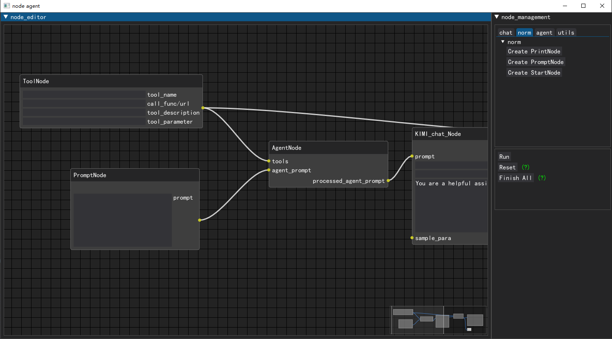
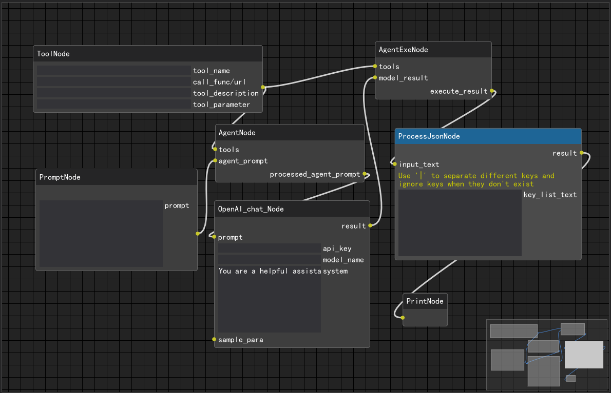
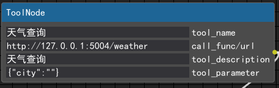
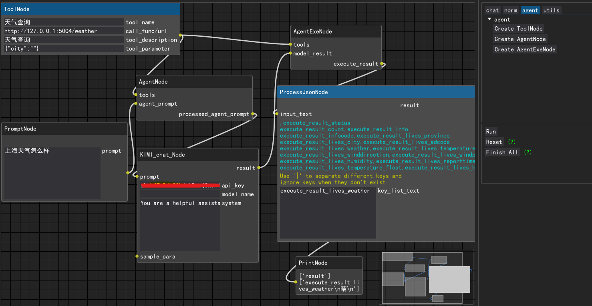

# node agent

This is a node editor for LLM angent scenarios, with the goal of making it easy for developers to experiment quickly.

## install

### 1. **Clone this repository**
```bash
git clone https://github.com/WatchTower-Liu/Agent-Node
cd Node-agent
```

### 2. **Install the inference package:**
```bash
conda create -n agentnode python=3.10 -y
conda activate agentnode
pip install -r requirements.txt
```

## method of application

This is a simple node editor, you can drag and drop the corresponding nodes and link them, and finally run the whole process.

**In fact, this is a technology prototype, so the functionality is relatively simple, and we will continue to improve.**

## sample

### 1. Start a service interface

This service interface is to achieve node request address consistency, you can refer to `src/server` code.

### 2. Construct node flow

Select tool_node and the associated agent node, as shown in the figure



### 3. Enter the corresponding parameters

For example, call_func/url in toolNode is the address of the local service started. You can refer to the configuration shown in the figure



### 4. Setting the model key
### 5. run 

result

